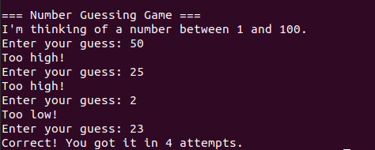
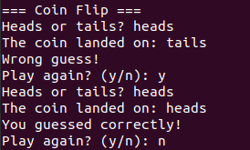
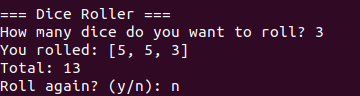
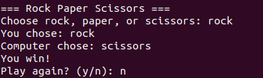
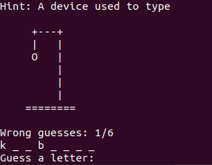
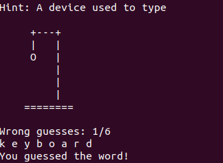

# Python Mini Games 🎮

A collection of Python mini games created while learning Python programming.

The project is organized into levels, with each level gradually increasing in difficulty and introducing new Python concepts.

---

## 📚 Project Levels

| Level       | Focus                 |
| ----------- | --------------------- |
| **Level 1** | Python Basics         |
| **Level 2** | Intermediate Python   |
| **Level 3** | Advanced Python       |
| **Level 4** | GUI & Complex Games   |
| **Level 5** | 2 Player / Networking |

---

# Level 1 — Python Basics

Level 1 focuses on the fundamentals of Python programming.

### Concepts

* Variables
* User input
* Conditional statements
* `while` loops
* `for` loops
* Functions
* Lists
* Random number generation
* Input validation
* Error handling
* Boolean logic
* String methods

### Games

#### 1. Number Guessing

Guess a randomly generated number between 1 and 100.

```text
Guess: 50
Too high!

Guess: 25
Too low!

Guess: 37
Correct!
```



**Theory:** [Number Guessing Theory](level-1/theory/number_guess.md)

---

#### 2. Coin Flip

Guess whether the randomly generated coin result is heads or tails.



**Theory:** [Coin Flip Theory](level-1/theory/coin_flip.md)

---

#### 3. Dice Roller

Roll one or multiple dice and calculate the total.



**Theory:** [Dice Roller Theory](level-1/theory/dice_roller.md)

---

#### 4. Rock Paper Scissors

Play Rock Paper Scissors against the computer.



**Theory:** [Rock Paper Scissors Theory](level-1/theory/rock_paper_scissors.md)

---

### Level 1 Theory

The Level 1 theory section is organized by game. Each document explains the Python concepts used to build that particular game.

See the [Level 1 Theory Guide](level-1/theory/README.md).

---

# Level 2 — Intermediate Python

Level 2 introduces more structured data, external data files, and more complex game logic.

### Concepts

* Lists
* Dictionaries
* JSON
* File handling
* `json.load()`
* Function parameters
* Return values
* More complex loops
* Data processing
* Game state
* Input validation

### Games

#### 1. Hangman

A word guessing game where the player attempts to reveal a hidden word before reaching the maximum number of wrong guesses.

Features include:

* Random word selection
* Random starting letter hint
* Dictionary-based word data
* JSON word storage
* Letter validation
* Tracking guessed letters
* Wrong guess counter
* ASCII Hangman drawing
* Game win/loss conditions

Word information is stored separately in:

```text
level-2/words.json
```

Example:

```json
{
    "python": "A popular programming language",
    "computer": "An electronic machine that processes data"
}
```





**Game:** [`level-2/hangman.py`](level-2/hangman.py)

---

### Level 2 Theory

A theory guide will document the intermediate Python concepts introduced throughout Level 2.

**Planned:** Level 2 theory will be added as more games are developed.

---

# 📁 Project Structure

```text
python-minigames/
│
├── level-1/
│   ├── number_guess.py
│   ├── coin_flip.py
│   ├── dice_roller.py
│   ├── rock_paper_scissors.py
│   │
│   └── theory/
│       ├── README.md
│       ├── number_guess.md
│       ├── coin_flip.md
│       ├── dice_roller.md
│       └── rock_paper_scissors.md
│
├── level-2/
│   ├── hangman.py
│   ├── words.txt
│   └── words.json
│
├── screenshots/
│   ├── number_guess.png
│   ├── coin_flip.png
│   ├── dice_roller.png
│   ├── rock_paper_scissors.png
│   ├── hangman_game.png
│   └── hangman_result.png
│
├── main.py
├── README.md
├── LICENSE
└── .gitignore
```

---

# ▶️ How to Run

Make sure Python 3 is installed.

From the project directory:

### Level 1

```bash
python3 level-1/number_guess.py
```

```bash
python3 level-1/coin_flip.py
```

```bash
python3 level-1/dice_roller.py
```

```bash
python3 level-1/rock_paper_scissors.py
```

### Level 2

```bash
python3 level-2/hangman.py
```

---

# 🧠 Learning Approach

The project is being developed progressively rather than creating all the games at once.

Each game introduces new programming concepts while reusing concepts learned from previous games.

The general progression is:

```text
Python Basics
      ↓
Intermediate Python
      ↓
Advanced Python
      ↓
GUI & Graphics
      ↓
2 Player / Networking
```

The goal is to understand **why the code works**, rather than simply copying finished programs.

---

# 🚧 Future Levels

### Level 3 — Advanced Python

Planned topics:

* Object-Oriented Programming
* Classes
* Objects
* Inheritance
* Larger program structures
* More advanced game mechanics

### Level 4 — GUI & Complex Games

Planned topics:

* Graphical interfaces
* Buttons
* Images
* Animations
* Sounds
* Game menus
* Launchers
* Graphical versions of existing games

### Level 5 — 2 Player / Networking

Planned topics:

* Local multiplayer
* Client/server architecture
* Python sockets
* Network communication
* Multiplayer game logic

---

# 📊 Project Status

🚧 **In development**

Current progress:

* [x] Level 1 — Python Basics
* [x] Number Guessing
* [x] Coin Flip
* [x] Dice Roller
* [x] Rock Paper Scissors
* [x] Level 1 Theory
* [x] Level 2 — Intermediate Python
* [x] Hangman
* [x] JSON word database
* [ ] Level 2 Theory
* [ ] Quiz Game
* [ ] Blackjack
* [ ] Number Analyzer
* [ ] Text Adventure
* [ ] Level 3
* [ ] Level 4
* [ ] Level 5

---

# 📜 License

This project is licensed under the **Apache License 2.0**.

