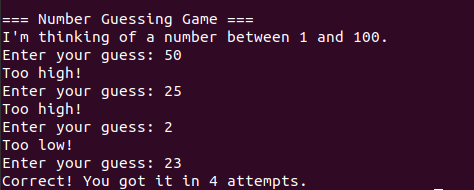
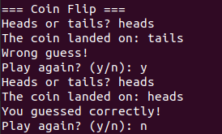
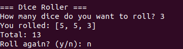
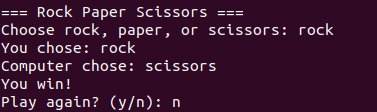
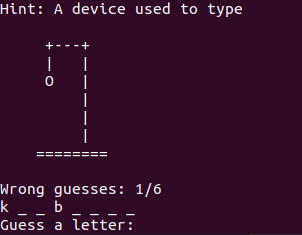
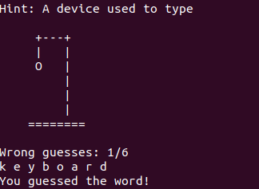

# Python Mini Games 🎮

A collection of Python mini games created while learning Python programming.

The project is organized into levels, with each level gradually increasing in difficulty and introducing new Python concepts.

The project includes both **Command-Line Interface (CLI)** and **Graphical User Interface (GUI)** versions of the games.

---

## 📚 Project Levels

| Level       | Focus                 |
| ----------- | --------------------- |
| **Level 1** | Python Basics         |
| **Level 2** | Intermediate Python   |
| **Level 3** | Advanced Python       |
| **Level 4** | GUI & Complex Games   |
| **Level 5** | 2 Player / Networking |

---

# Level 1 — Python Basics

Level 1 focuses on the fundamentals of Python programming.

### Concepts

* Variables
* User input
* Conditional statements
* `while` loops
* `for` loops
* Functions
* Lists
* Random number generation
* Input validation
* Error handling
* Boolean logic
* String methods

### Games

#### 1. Number Guessing

Guess a randomly generated number between 1 and 100.

```text
Guess: 50
Too high!

Guess: 25
Too low!

Guess: 37
Correct!
```



**Theory:** [Number Guessing Theory](level-1/theory/number_guess.md)

---

#### 2. Coin Flip

Guess whether the randomly generated coin result is heads or tails.



**Theory:** [Coin Flip Theory](level-1/theory/coin_flip.md)

---

#### 3. Dice Roller

Roll one or multiple dice and calculate the total.



**Theory:** [Dice Roller Theory](level-1/theory/dice_roller.md)

---

#### 4. Rock Paper Scissors

Play Rock Paper Scissors against the computer.



**Theory:** [Rock Paper Scissors Theory](level-1/theory/rock_paper_scissors.md)

---

### Level 1 Theory

The Level 1 theory section is organized by game. Each document explains the Python concepts used to build that particular game.

See the [Level 1 Theory Guide](level-1/theory/README.md).

---

# Level 2 — Intermediate Python

Level 2 introduces more structured data, external data files, and more complex game logic.

### Concepts

* Lists
* Dictionaries
* JSON
* File handling
* `json.load()`
* Function parameters
* Return values
* More complex loops
* Data processing
* Game state
* Input validation
* Nested loops
* Random selection
* More complex game rules

### Games

#### 1. Hangman

A word guessing game where the player attempts to reveal a hidden word before reaching the maximum number of wrong guesses.

Features include:

* Random word selection
* Random starting letter hint
* Dictionary-based word data
* JSON word storage
* Letter validation
* Tracking guessed letters
* Wrong guess counter
* ASCII Hangman drawing
* Game win/loss conditions

Word information is stored separately in:

```text
level-2/words.json
```

Example:

```json
{
    "python": "A popular programming language",
    "computer": "An electronic machine that processes data"
}
```





**Game:** [`level-2/hangman.py`](level-2/hangman.py)

**Theory:** [Hangman Theory](level-2/theory/hangman.md)

---

#### 2. Blackjack

A simplified Blackjack game where the player competes against the dealer.

Features include:

* 52-card deck
* Card shuffling
* Player and dealer hands
* Hit or Stand decisions
* Dealer rules
* Blackjack detection
* Ace value handling
* Score calculation
* Win/loss/draw conditions

**Game:** [`level-2/blackjack.py`](level-2/blackjack.py)

**Theory:** [Blackjack Theory](level-2/theory/blackjack.md)

---

#### 3. Tic-Tac-Toe

A two-player Tic-Tac-Toe game with an optional simple AI opponent.

Features include:

* Player vs Player mode
* Player vs AI mode
* Board representation using lists
* Position validation
* Win detection
* Draw detection
* Game state management
* Random-move AI
* Replay functionality

**Game:** [`level-2/tic_tac_toe.py`](level-2/tic_tac_toe.py)

**Theory:** [Tic-Tac-Toe Theory](level-2/theory/tic_tac_toe.md)

---

### Level 2 Theory

Level 2 theory documents explain the Python concepts introduced by each game.

The theory focuses on understanding **why the code works**, rather than simply copying the code.

---

# 🖥️ CLI and GUI Interfaces

The project supports two different ways of playing the games.

## Command-Line Interface (CLI)

The original games are designed to run directly in the terminal.

For example:

```bash
python3 level-1/coin_flip.py
```

The CLI versions use:

* `input()`
* Terminal output
* Text-based menus
* Keyboard input
* Console game loops

The CLI games remain separate from the GUI versions.

---

## 🖼️ Graphical User Interface (GUI)

A GUI version of the games is being developed using Python's built-in **Tkinter** library.

The GUI includes a central game launcher where players can select games.

Current GUI structure:

```text
gui/
├── game_launcher.py
└── coin_flip_gui.py
```

The GUI launcher can be started with:

```bash
python3 gui/game_launcher.py
```

### Why separate CLI and GUI versions?

The CLI and GUI versions are intentionally kept separate.

This allows the project to demonstrate how the same game concept can be implemented using different interfaces.

```text
CLI
  ↓
Terminal input/output

GUI
  ↓
Tkinter windows, buttons and events
```

The GUI version introduces new Python concepts such as:

* Tkinter
* Windows
* Labels
* Buttons
* Frames
* `Toplevel()` windows
* Button commands
* Event-driven programming
* GUI layout
* Separating interface code from game code

The GUI will be expanded gradually as more games are converted.

---

# 📁 Project Structure

```text
python-minigames/
│
├── level-1/
│   ├── number_guess.py
│   ├── coin_flip.py
│   ├── dice_roller.py
│   ├── rock_paper_scissors.py
│   │
│   └── theory/
│       ├── README.md
│       ├── number_guess.md
│       ├── coin_flip.md
│       ├── dice_roller.md
│       └── rock_paper_scissors.md
│
├── level-2/
│   ├── hangman.py
│   ├── blackjack.py
│   ├── tic_tac_toe.py
│   ├── words.txt
│   ├── words.json
│   │
│   └── theory/
│       ├── hangman.md
│       ├── blackjack.md
│       └── tic_tac_toe.md
│
├── gui/
│   ├── game_launcher.py
│   └── coin_flip_gui.py
│
├── screenshots/
│   ├── number_guess.png
│   ├── coin_flip.png
│   ├── dice_roller.png
│   ├── rock_paper_scissors.png
│   ├── hangman_game.png
│   └── hangman_result.png
│
├── main.py
├── README.md
├── LICENSE
└── .gitignore
```

---

# ▶️ How to Run

Make sure Python 3 is installed.

From the project directory:

## CLI — Level 1

```bash
python3 level-1/number_guess.py
```

```bash
python3 level-1/coin_flip.py
```

```bash
python3 level-1/dice_roller.py
```

```bash
python3 level-1/rock_paper_scissors.py
```

## CLI — Level 2

```bash
python3 level-2/hangman.py
```

```bash
python3 level-2/blackjack.py
```

```bash
python3 level-2/tic_tac_toe.py
```

## GUI

```bash
python3 gui/game_launcher.py
```

---

# 🧠 Learning Approach

The project is being developed progressively rather than creating all the games at once.

Each game introduces new programming concepts while reusing concepts learned from previous games.

The general progression is:

```text
Python Basics
      ↓
Intermediate Python
      ↓
Advanced Python
      ↓
GUI & Graphics
      ↓
2 Player / Networking
```

The goal is to understand **why the code works**, rather than simply copying finished programs.

Each game is accompanied by theory documentation explaining the Python concepts used to build it.

---

# 🚧 Future Levels

### Level 3 — Advanced Python

Planned topics:

* Object-Oriented Programming
* Classes
* Objects
* Inheritance
* Larger program structures
* More advanced game mechanics

### Level 4 — GUI & Complex Games

The GUI development has already started.

Planned topics:

* Graphical interfaces
* Buttons
* Images
* Animations
* Sounds
* Game menus
* Launchers
* Graphical versions of existing games
* More advanced GUI layouts

### Level 5 — 2 Player / Networking

Planned topics:

* Local multiplayer
* Client/server architecture
* Python sockets
* Network communication
* Multiplayer game logic

---

# 📊 Project Status

🚧 **In development**

Current progress:

* [x] Level 1 — Python Basics

* [x] Number Guessing

* [x] Coin Flip

* [x] Dice Roller

* [x] Rock Paper Scissors

* [x] Level 1 Theory

* [x] Level 2 — Intermediate Python

* [x] Hangman

* [x] Blackjack

* [x] Tic-Tac-Toe

* [x] JSON word database

* [x] Level 2 Theory

* [x] GUI launcher

* [x] GUI / CLI separation

* [x] GUI Coin Flip

* [ ] GUI Dice Roller

* [ ] GUI Number Guessing

* [ ] GUI Rock Paper Scissors

* [ ] GUI Hangman

* [ ] GUI Blackjack

* [ ] GUI Tic-Tac-Toe

* [ ] Level 3

* [ ] Level 5

---

# 📜 License

This project is licensed under the **Apache License 2.0**.

